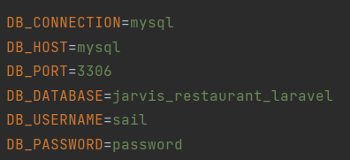

## สมาชิกในกลุ่ม
___
| รหัสนิสิต   | ชื่อ-นามสกุล            | github                           | วิชาที่เรียน |
|-------------|-------------------------|----------------------------------|--------------|
| 6310400941  | จิรัชญา ผ่านพินิจ       | https://github.com/JaeAiKay      | SE + Web     |
| 6310400983  | ณัฐกานต์ ขีดเข้ม        | https://github.com/nattakarnview | Web          |
| 6310401327  | ณัฐพงศ์ พิมพิสาร        | https://github.com/changatKU     | SE           |
| 6310401980  | วงศกร เสนีวงศ์ ณ อยุธยา | https://github.com/Zesiria       | SE + Web     |
| 6310406370  | อกนิษฐ์ เดชสุวรรณ       | https://github.com/Akanitt       | SE           |

## แนะนำโปรเจค
___
ระบบนี้เป็นระบบที่จะช่วยจัดการร้านบุฟเฟ่ต์ ซึ่งรองรับการสั่งอาหารผ่านระบบภายในร้าน
แทนการใช้กระดาษ การตรวจสอบสถานะของอาหารที่สั่ง การรีวิวร้านค้า และการตรวจสอบ
ข้อมูลทางสถิติภายในร้านด้วย

## Background
___
ร้านบุฟเฟต์แห่งหนึ่ง ราคาต่อหัวอยู่ที่ 219 บาท, เครื่องดื่มรีฟิล 39 บาท, service charge 10% ต่อบิล
เจ้าของร้านอยากได้ระบบจัดการร้าน โดยลักษณะการดำเนินธุรกิจของร้านคือลูกค้าจะ walk-in หน้าร้านเมื่อลูกค้า
มาถึงพนักงานจะทำการเปิดโต๊ะให้ลูกค้าหลังจากนั้นลูกค้าจะทำการเลือกเมนูในใบสั่งอาหาร โดยเมนูที่เลือกคือวัตถุดิบที่
ทางร้านมี หลังจากลูกค้าทานเสร็จแล้วจะทำการจ่ายเงินที่เค้าเตอร์ เจ้าของร้านอยากให้ลูกค้าสั่งอาหารผ่านระบบ แทนที่
จะใช้กระดาษแบบเดิมและลูกค้าสามารถดูได้ว่าอาหารที่ลูกค้าสั่งไปถึงขั้นตอนไหนและมีระบบแสดงความคิดเห็นต่อการให้บริการของทางร้านเพื่อนำไปปรับปรุง
ในส่วนของครัวเจ้าของร้านอยากได้ระบบที่แสดงผลว่าลูกค้าสั่งเมนูไหนมาบ้างเพื่อที่จะได้เตรียมอาหารได้อย่างรวดเร็วปกติจะมีปัญหาคือ
วัตถุดิบหมดแต่ลูกค้าก็สั่งมาจนบางครั้งลูกค้าไม่พอใจเลยอยากให้ระบบมีการตัด stock ให้อัตโนมัติ
นอกจากนี้เจ้าของร้านอยากรู้ว่าอาหารชนิดไหนถูกสั่งเป็นจำนวนเท่าไหร่เพื่อที่จะได้วางแผนจัดการวัตถุดิบ

## ขั้นตอนการติดตั้งโปรเจค
___
1. ติดตั้ง docker desktop จาก https://www.docker.com/products/docker-desktop/
2. ติดตั้ง WSL2 จาก https://docs.docker.com/desktop/windows/wsl/
3. Clone project จาก link API backend https://github.com/Zesiria/JARVIS-Restaurant-Laravel
4. Clone project จาก link frontend https://github.com/Zesiria/JARVIS-Restaurant-Vue
5. เปิดโปรแกรม docker desktop และ WSL2

## ขั้นตอนการ run project (API backend)
___
ใช้ WSL2 change directory ไปที่ API backend แล้วรันคำสั่ง

```angular2html
cp .env.example .env
```

```angular2html
docker run --rm \
-u "$(id -u):$(id -g)" \
-v $(pwd):/var/www/html \
-w /var/www/html \
laravelsail/php81-composer:latest \
composer install --ignore-platform-reqs
```


จะได้ ไฟล์ .env ให้ setup ตามรูปด้านล่าง



รันคำสั่งเพื่อตั้ง alias ให้กับ vendor/bin/sail
```angular2html
alias sail='[ -f sail ] && sh sail || sh vendor/bin/sail'
```

```angular2html
sail up -d
```

```angular2html
sail artisan key:generate
```

```angular2html
sail artisan migrate:fresh
```

```angular2html
python3 seed_data.py
```

## ขั้นตอนการ run project (frontend)
___
ใช้ WSL2 change directory ไปที่ frontend แล้วรันคำสั่ง
```angular2html
docker compose up -d
```
```angular2html
docker compose exec app npm install
```
```angular2html
docker compose exec cp .env.example .env
```
```angular2html
docker compose exec app npm run dev
```

## การ route web api
| Model     | link                             |
|-----------|----------------------------------|
| Food      | http://localhost/api/foods       |
| Customer  | http://localhost/api/customers   |
| Table     | http://localhost/api/tables      |
| Order     | http://localhost/api/orders      |
| FoodOrder | http://localhost/api/food-orders |
| Review    | http://localhost/api/reviews     |

ดูเพิ่มเติมได้ที่ ไฟล์ routes/api.php

## ข้อมูลเพิ่มเติม
___
| ข้อมูล             | ไฟล์                                                                                   |
|--------------------|----------------------------------------------------------------------------------------|
| User Story         | [information.pdf](information.pdf)                                                     |
| Personas           | [information.pdf](information.pdf)                                                     |
| User Journey       | [information.pdf](information.pdf)                                                     |
| Burn-down chart    | [information.pdf](information.pdf)                                                     |
| UI Flow            | [ui-flow.pdf](ui-flow.pdf)                                                             |
| Jmeter config file | [Jarvis-HTTP-Request.jmx](Jarvis-HTTP-Request.jmx)                                     |
| Jira               | [Jira Link](https://wongsakonproject.atlassian.net/jira/software/projects/JR/boards/2) |


